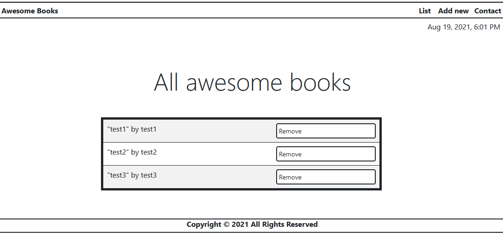

# Project Name

> Awesome books project.

In this project, you will build a basic website that allows users to add/remove books from a list. You will achieve that by using JavaScript objects and arrays. You will also need to dynamically modify the DOM and add basic events.

## Built With
- HTML, CSS, JS
- Linters, Node.js, Git, Flexbox

## Authors (Github: Herokudev)
Herbert Orellana

- GitHub: [@herokudev](https://github.com/herokudev)
- LinkedIn: [LinkedIn](https://linkedin.com/in/armando-orellana-a0b50b34)

## Live Demo

[Live Demo Link](https://livedemo.com)

## Authors

👤 **Author1** (Github: Herokudev)
Herbert Orellana

- GitHub: [@herokudev](https://github.com/herokudev)
- LinkedIn: [LinkedIn](https://linkedin.com/in/armando-orellana-a0b50b34)

## 🤝 Contributing

Contributions, issues, and feature requests are welcome!

## Show your support

Give a ⭐️ if you like this project!

## 📝 License

This project is [MIT](./MIT.md) licensed.
